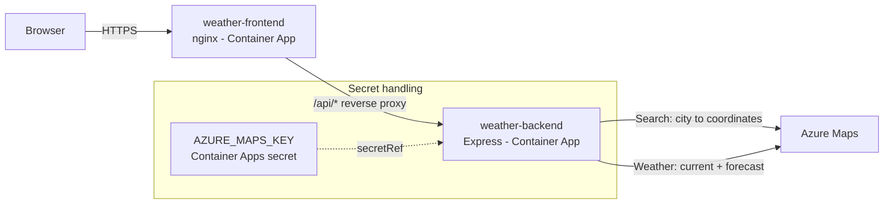
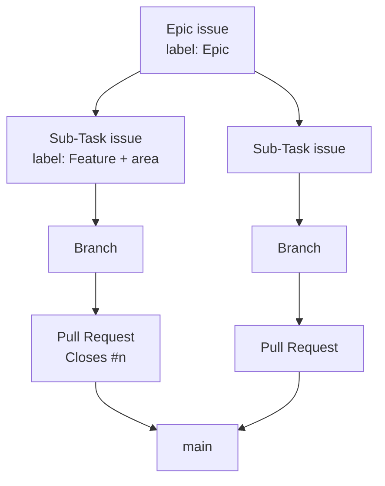
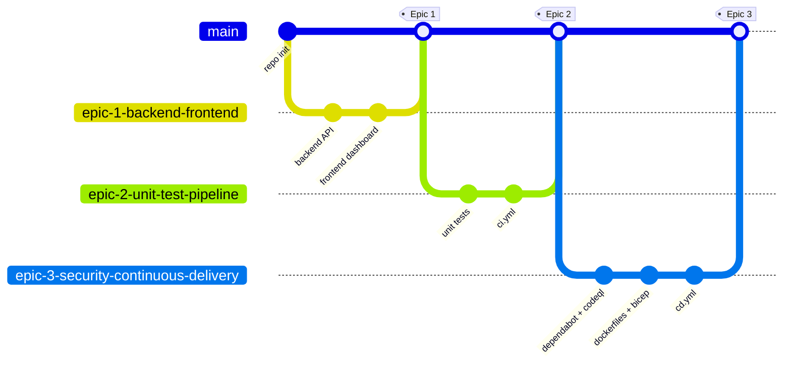
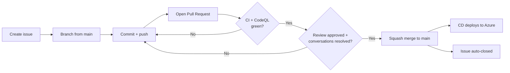
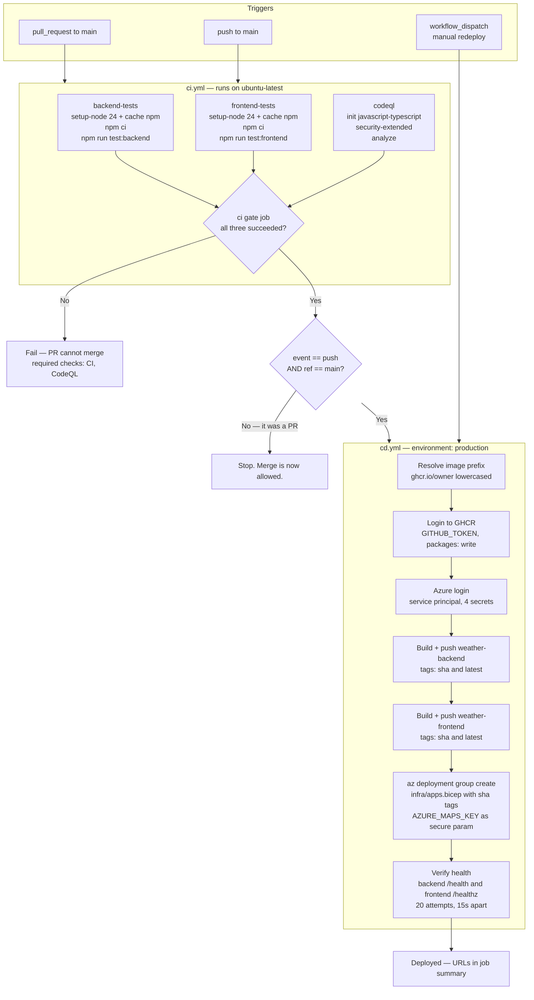

[](https://github.com/AZ-2008-DevOps-Foundation/DevOps-Foundation-Aug2026/actions/workflows/ci.yml)

# DevOps Foundation — Weather Dashboard

> 📘 New to the course? Start with the [**Student Recap & Notes**](docs/student-recap.md) — a summary of the concepts covered in the instructor-led session.

A hands-on reference repository for **AZ-2008 DevOps Foundation**. It uses one small Node.js web app to walk through the whole delivery loop: plan work on GitHub → branch → pull request → automated tests → security scan → container build → deploy to Azure.

The app itself is deliberately simple so the DevOps practices stay in focus.

---

## 1. The application

A weather dashboard for a fixed set of cities. Data comes from **Azure Maps**.

| Piece | Tech | Location |
| --- | --- | --- |
| Backend API | Node.js 24 + Express (ESM) | [src/](src/) |
| Frontend | Static HTML/CSS/JS + Bootstrap + Leaflet | [public/](public/) |
| Infrastructure | Bicep (Azure Container Apps) | [infra/](infra/) |
| Pipelines | GitHub Actions | [.github/workflows/](.github/workflows/) |

### Runtime shape



The frontend never calls Azure Maps and never sees the key. nginx proxies `/api/*` to the backend, so the browser stays same-origin and there is no CORS exposure.

### API surface

| Endpoint | Purpose |
| --- | --- |
| `GET /health` | Liveness/readiness probe |
| `GET /api/cities` | Supported cities (flags, coordinates, timezones) |
| `GET /api/weather?city=&country=` | Current conditions |
| `GET /api/forecast?city=&country=&days=` | 1–15 day daily forecast |

---

## 2. Plan — Issues, labels and Projects

Work is broken down before any branch exists. This repo uses a two-level hierarchy:



### The real backlog in this repo

| # | Issue | Labels |
| --- | --- | --- |
| 1 | [Epic 1] Build — Backend & Frontend | `Epic` |
| 2 | Sub-Task 1.1: Backend — Weather & Map API | `Feature`, `Backend` |
| 3 | Sub-Task 1.2: Frontend — Dashboard & City Detail View | `Feature`, `Frontend` |
| 4 | [Epic 2] Test & Enable Pipeline | `Epic` |
| 5 | Sub-Task 2.1: Backend & Frontend Unit Tests | `Feature`, `Testing` |
| 6 | Sub-Task 2.2: Enable CI Pipeline with GitHub Actions Runners | `Feature`, `CI/CD` |
| 7 | [Epic 3] Security Scanning & Container Apps Deployment | `Epic` |
| 8 | Sub-Task 3.1: Security Scan Gate (Dependabot + CodeQL) | `Feature`, `Security` |
| 9 | Sub-Task 3.2: Push images and deploy to Azure Container Apps | `Feature`, `CI/CD` |

Practices to follow:

- Every Epic is an issue. Every unit of deliverable work is a Sub-Task issue with **acceptance criteria written as a checklist** — that checklist is what the PR is reviewed against.
- Labels carry two dimensions: type (`Epic`, `Feature`) and area (`Backend`, `Frontend`, `Testing`, `CI/CD`, `Security`).
- A **GitHub Project (board)** tracks flow state — `Todo → In Progress → In Review → Done`. Add both Epics and Sub-Tasks to the board; use the Epic as the parent/tracking item.
- Reference the issue from the PR body with `Closes #n` so merging auto-closes it.

---

## 3. Branches in this repo

We follow **GitHub Flow**: `main` is always deployable, everything else is a short-lived branch that arrives through a pull request.

| Branch | Role |
| --- | --- |
| `main` | Protected, always deployable. Every push here triggers CI **and** CD. |
| `epic-1-backend-frontend` | Epic 1 — backend API + frontend dashboard |
| `epic-2-unit-test-pipeline` | Epic 2 — unit tests + CI pipeline |
| `epic-3-security-continuous-delivery` | Epic 3 — Dependabot, CodeQL, containers, CD |
| `copilot/sub-task-1-2-frontend-dashboard-city-detail-view` | Example agent-generated sub-task branch |

Naming convention: `epic-<n>-<short-topic>` for epic branches, `sub-task-<n>.<m>-<short-topic>` (or `copilot/...` when raised by an agent) for smaller slices.



### Branch protection on `main`

Configured on the repository, not in code:

| Rule | Value |
| --- | --- |
| Required status checks | `CI`, `CodeQL` |
| Require branches up to date before merge | Yes (strict) |
| Require a pull request before merging | Yes |
| Required approvals | 0 (single-author course repo — raise for team use) |
| Require conversation resolution | Yes |
| Force pushes / deletions | Blocked |

Because `CI` and `CodeQL` are required, a PR physically cannot merge until tests and the security scan are green.

### The pull request loop



---

## 4. Running it locally

Prerequisites: Node.js 22 or newer (CI uses 24), an Azure Maps account.

```bash
npm install
cp .env.example .env      # then paste your key into AZURE_MAPS_KEY
npm start                 # http://localhost:3000
```

`.env` is git-ignored. The app **fails fast at startup** if `AZURE_MAPS_KEY` is missing — a deliberate choice so a misconfigured container never serves broken responses:

```
Error: Missing required configuration "AZURE_MAPS_KEY". Copy .env.example to .env and set a value.
```

Use the Azure Maps **Shared Key** (Azure Portal → Azure Maps account → Authentication → Shared Key Authentication), not a Cognitive Services / AI Services key.

---

## 5. Tests

```bash
npm test              # everything (single command)
npm run test:backend  # backend only
npm run test:frontend # frontend only
npm run test:watch    # watch mode
```

Runner: **Vitest**, with `jsdom` for the frontend and `supertest` for HTTP-level backend tests.

| Suite | File | What it covers |
| --- | --- | --- |
| Unit — service layer | [tests/backend/azure-maps.test.js](tests/backend/azure-maps.test.js) | Parsing of Azure Maps geocode / current-conditions / forecast payloads, UV index extraction, forecast-duration selection, error mapping (502 / 504), and that upstream error bodies are never echoed back |
| Integration — HTTP routes | [tests/backend/api.test.js](tests/backend/api.test.js) | The real Express app via `supertest`: happy paths, 400 on missing city, 404 on unsupported city, `days` validation, unknown routes, `/health` |
| Unit — frontend | [tests/frontend/dashboard.test.js](tests/frontend/dashboard.test.js) | Renders the real `public/index.html` in jsdom: country grouping, flag images, temperature/emoji binding, error states, card click → detail view navigation |

Note on terminology: the route suite is a **component/integration test** — it boots the actual Express application and exercises real routing, validation and error middleware. Only the outbound Azure Maps HTTP boundary is stubbed. There is no end-to-end suite against deployed infrastructure yet; that would be the natural next step (Playwright against the deployed frontend URL).

### How `AZURE_MAPS_KEY` is handled in tests

No test ever calls Azure Maps. `global.fetch` is stubbed in every suite, and unmapped URLs deliberately throw so an accidental real call fails loudly.

[tests/setup.js](tests/setup.js) supplies a placeholder only when the variable is absent:

```js
process.env.AZURE_MAPS_KEY ||= 'test-subscription-key';
```

That means the same command works in three places without change:

- Locally with a real key in `.env` — the real value is used (but never sent anywhere).
- Locally with no key at all — the placeholder satisfies startup config.
- In CI — the `AZURE_MAPS_KEY` secret is injected as an environment variable.

**No key is ever committed.** `.env` is in `.gitignore`; only `.env.example` (empty values) is tracked.

---

## 6. Secrets and variables

Repository → Settings → Secrets and variables → Actions.

### Secrets (encrypted, never printed)

| Secret | Used by | Purpose |
| --- | --- | --- |
| `AZURE_MAPS_KEY` | CI + CD | Test env var; injected into the backend Container App as a secret reference |
| `AZURE_CLIENT_ID` | CD | Entra service principal |
| `AZURE_CLIENT_SECRET` | CD | Service principal secret |
| `AZURE_TENANT_ID` | CD | Entra tenant |
| `AZURE_SUBSCRIPTION_ID` | CD | Target subscription |
| `GITHUB_TOKEN` | CD | Built-in — pushes images to GHCR, no setup needed |

### Variables (plain text, safe to read)

| Variable | Example | Purpose |
| --- | --- | --- |
| `AZURE_RESOURCE_GROUP` | `rg-weather-demo` | Deployment target |
| `AZURE_NAME_PREFIX` | `weather` | Resource naming prefix (defaults to `weather`) |

Set them without exposing values in a terminal history or chat:

```bash
gh secret set AZURE_MAPS_KEY          # prompts for the value
gh variable set AZURE_RESOURCE_GROUP --body "rg-weather-demo"
```

Rules of thumb taught here:
1. Anything that grants access is a **secret**; anything that is merely a name is a **variable**.
2. Secrets are masked in logs — but never `echo` them anyway.
3. Application secrets reach the container through a Container Apps **secret reference**, not a plain environment value and never baked into the image.

---

## 7. The pipeline

Two workflow files, deliberately split:

| File | Trigger | Responsibility |
| --- | --- | --- |
| [.github/workflows/ci.yml](.github/workflows/ci.yml) | `push` to `main`, `pull_request` → `main` | Test, scan, gate |
| [.github/workflows/cd.yml](.github/workflows/cd.yml) | `workflow_call` (from CI), `workflow_dispatch` | Build images, deploy, verify |

CD is a **reusable workflow** rather than its own `on: push` workflow. `needs:` cannot cross workflow files, so a standalone CD would race the tests instead of waiting for them. Calling it from CI keeps a single dependency chain while keeping the YAML small.

### Full pipeline



Key conditions to notice:

- `concurrency: ci-${{ github.ref }}` with `cancel-in-progress` — a new push supersedes an in-flight run on the same branch.
- The `ci` gate job uses `if: always()` so it evaluates every dependency's result explicitly instead of being skipped when one fails.
- The deploy job is guarded by `if: github.event_name == 'push' && github.ref == 'refs/heads/main'` — pull requests test and scan, but never deploy.
- Least-privilege tokens: the workflow defaults to `contents: read`; only the CodeQL job gets `security-events: write` and only the deploy job gets `packages: write`.

### Security scanning

| Tool | Config | Cadence |
| --- | --- | --- |
| CodeQL | `codeql` job in [ci.yml](.github/workflows/ci.yml) | Every push and PR to `main`; a required check |
| Dependabot | [.github/dependabot.yml](.github/dependabot.yml) | Weekly, Mondays — npm + github-actions ecosystems, grouped into prod/dev PRs |

---

## 8. Containers and deployment

Two images, each built from a multi-stage Dockerfile and published to **GitHub Container Registry**:

| Image | Dockerfile | Base | Notes |
| --- | --- | --- | --- |
| `ghcr.io/<owner>/weather-backend` | [Dockerfile.backend](Dockerfile.backend) | `node:24-alpine` | `npm ci --omit=dev`, runs as non-root `node`, `HEALTHCHECK` on `/health` |
| `ghcr.io/<owner>/weather-frontend` | [Dockerfile.frontend](Dockerfile.frontend) | `nginx-unprivileged:1.27-alpine` | Non-root, listens on 8080, proxies `/api/*` to `BACKEND_URL` |

Both are tagged with the **commit SHA** (immutable, traceable) and `latest` (convenience). Deployments always reference the SHA tag, never `latest`.

> GHCR packages are **private on first push**. After the first CD run, set each package to Public (org → Packages → package → Package settings → Change visibility), otherwise Container Apps cannot pull them.

### Infrastructure

| File | Scope | Run by |
| --- | --- | --- |
| [infra/main.bicep](infra/main.bicep) | Log Analytics, Container Apps environment, optional least-privilege deployer role | An admin, once |
| [infra/apps.bicep](infra/apps.bicep) | The two Container Apps, images, ingress, probes, secrets | The CD pipeline, every deploy |

One-time provisioning:

```bash
az group create -n rg-weather-demo -l southeastasia
az deployment group create -g rg-weather-demo -f infra/main.bicep \
  --parameters namePrefix=weather deployerPrincipalId=<sp-object-id>
```

`deployerPrincipalId` is optional. When supplied, Bicep creates a custom role limited to reading/writing Container Apps and running deployments — the pipeline gets nothing more than it needs.

---

## 9. Repository layout

```
.github/
  workflows/ci.yml        Test + scan + gate
  workflows/cd.yml        Build + deploy (reusable)
  dependabot.yml          Weekly dependency updates
docker/nginx/             nginx config template for the frontend image
infra/                    Bicep: main.bicep (platform), apps.bicep (workload)
public/                   Frontend: index.html, css/, js/
src/                      Backend: server.js, app.js, routes/, services/, data/
tests/                    backend/, frontend/, fixtures/, helpers/, setup.js
Dockerfile.backend        Multi-stage Node image
Dockerfile.frontend       Multi-stage nginx image
```

---

## 10. Suggested lab order

1. Create an Epic issue and two Sub-Task issues with acceptance-criteria checklists; add them to a Project board.
2. Branch, implement one sub-task, push, open a PR — watch CI run and block the merge until green.
3. Break a test on purpose and confirm the PR becomes unmergeable.
4. Add the `AZURE_MAPS_KEY` secret and confirm it never appears in logs.
5. Merge and watch CD build both images, deploy, and verify the health endpoints.
6. Merge a Dependabot PR and observe the same gates apply to it.
